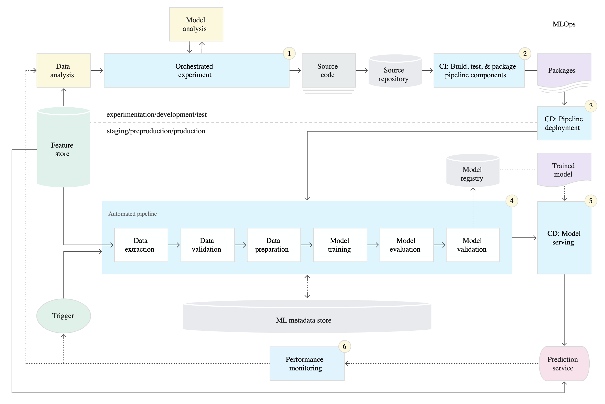

# Machine Learning Docker Template

This repo represents a minimal suggested setup for a machine learning project.

## Directory

        ├── README.md 
        ├── docs                        <- Documentation and artifacts (images)
        ├── ml_docker_template          <- Placeholder package name; replace after cloning template
        │   ├── artifacts               <- Data or models generated during model process
        │   │   └── .gitkeep
        │   ├── data_extraction.py      <- Sources raw data from databases, APIs, CSVs
        │   ├── data_preparation.py     <- Cleans raw data and generates train and test sets
        │   ├── model_training.py       
        │   ├── model_evaluation.py     <- Model is evaluated on a holdout test set
        │   ├── model_validation.py     <- Validate model and push to registry
        ├── notebooks                   <- Non-production Jupyter notebooks: analysis, exploration, viz
        ├── tests                       <- Each code merge to main branch must pass these tests
        ├── conda.yml                   <- All codebase dependencies are managed by Miniconda
        ├── Dockerfile                  <- Miniconda base image

## Architecture
Source: [Google MLOps](https://cloud.google.com/architecture/mlops-continuous-delivery-and-automation-pipelines-in-machine-learning#mlops_level_2_cicd_pipeline_automation)

## Docker commands

### Run container

        docker-compose -f docker-compose.yml up -d

### Stop and delete container

        docker-compose -f docker-compose.yml down

### Open container terminal

        docker exec -it ml /bin/bash

## Commit runboook

        docker exec -it ml bash -c 'black ml_docker_template'

## Notebooks

### Connect to jupyter server using VS Code
- After running docker-compose, open separate terminal and run

        docker exec -it ml jupyter notebook --ip 0.0.0.0 --port 8888 --allow-root

- Copy server URL with token (e.g. `http://127.0.0.1:8888/?token={some_token}`)
- Follow instructions [Connect to a remote Jupyter server](https://code.visualstudio.com/docs/datascience/jupyter-notebooks#_connect-to-a-remote-jupyter-server)

### Execute Jupyter notebook in docker and save output

        papermill analysis.ipynb analysis-output.ipynb -k python

## Credits
- [cookiecutter-data-science](https://github.com/drivendata/cookiecutter-data-science)
- [Papermill](https://github.com/nteract/papermill)
- [Google MLOps](https://cloud.google.com/architecture/mlops-continuous-delivery-and-automation-pipelines-in-machine-learning)
